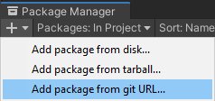
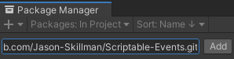

# Unity-Singleton
Easily transform your MonoBehavior classes into singletons.

## How to install
This package can be installed through the Unity `Package Manager` with Unity version 2019.3 or greater.

Open up the package manager `Window/Package Manager` and click on `Add package from git URL...`.



Paste in this repository's url.

`https://github.com/Jason-Skillman/Unity-Singleton.git`



Click `Add` and the package will be installed in your project.

---
**NOTE:** For Unity version 2019.2 or lower

If you are using Unity 2019.2 or lower than you will not be able to install the package with the above method. Here are a few other ways to install the package.
1. You can clone this git repository into your project's `Packages` folder.
1. Another alternative would be to download this package from GitHub as a zip file. Unzip and in the `Package Manager` click on `Add package from disk...` and select the package's root folder.

---

## Singleton behavior
To easily create a singleton have your script extend `SingletonBehavior<T>` where `T` will be the name of the class.

```C#
public class GameManager : SingletonBehavior<GameManager> {
```

Every `SingletonBehavior` will have a static `Instance` property to access your singleton from anywhere. You will have access to all public variables, properties, and methods of that class.

```C#
GameManager.Instance.MyMethod();
```

`SingletonBehavior` uses the `MonoBehavior` `Awake()` Unity message to create the instance so you will have to override and call its base to properly use the Awake method in your script.

```C#
protected override void Awake() {
	base.Awake()
	
	//Your code here...
}
```
